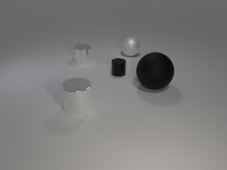
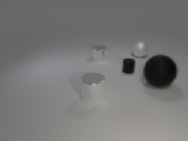

# CLEVR_dataset

Adopted code used in the [CLEVR: A Diagnostic Dataset for Compositional Language and Elementary Visual Reasoning](http://cs.stanford.edu/people/jcjohns/clevr/) paper presented at CVPR 2017 to render 7000 synthetic images of random objects against a uniform background for training and testing the VAE/feedforward net used in my research with the Buschman Lab. 

All images are black and white with 3 to 7 randomly placed objects. We also modified the rendering code to render, for any given image, a corresponding rotated image that contains the same objects/scene but simply with the camera angle rotated anywhere from -0.7 to 0.7 radians (approx 45 degrees in viewpoint). This mimics the saccade shift that human eyes make when we shift our attention from one center to another when viewing a scene. Below is an example of an image and after a rotation of 0.23 radians: 

  

  

Next, we used a retina filter adopted from https://github.com/ouyangzhibo/Image_Foveation_Python to simulate how these images should look like from a human eye. We set sigma = 0.5 to dictate the size of the foveal region as well as the degree of blur on the peripheral vision. Here are what the images look like after a retina filter has been placed in the center of the image: 

  

  

